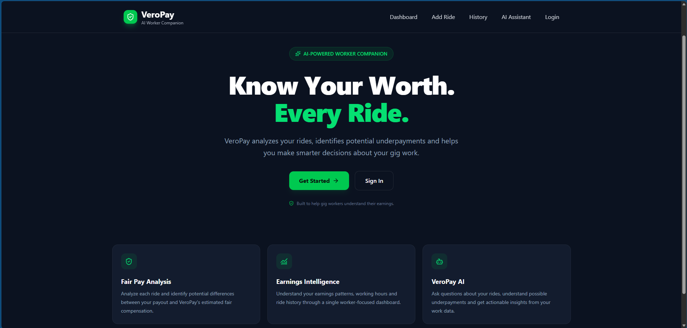
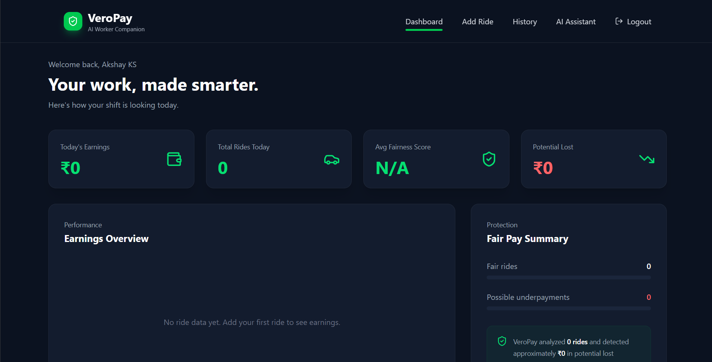
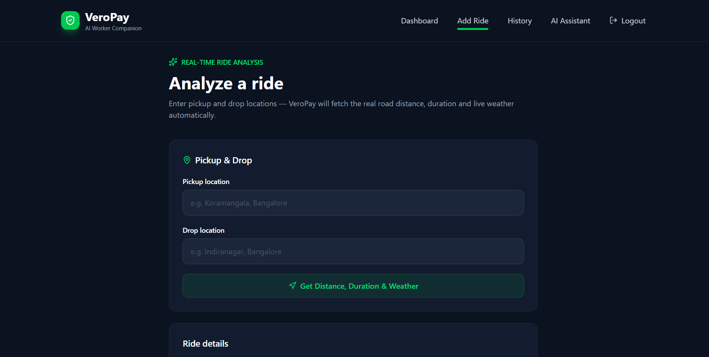
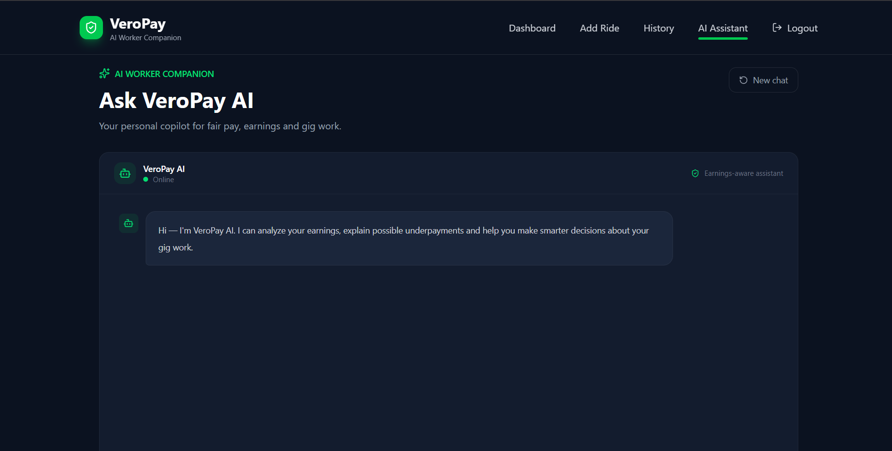

# 🛡️ VeroPay AI

### AI-Powered Fair Pay & Safety Companion for Gig Workers

**Submission for SYNAPTRIX 2026**  
BMSCE IEEE Computer Society × Protocol

---

## 🎯 Problem Statement Chosen

**Domain:** GigShield — Gig Economy & Informal Sector Tech

**Problem Statement:**  
Build an AI-powered companion for gig workers that goes beyond simple earnings tracking — acting as a financial coach, safety net, and rights advisor that helps workers understand whether their earnings are fair, safe, and sustainable.

---

## 👥 Team

**Team Name:** [YOUR TEAM NAME]

**Team Members:**
- [Member 1]
- [Member 2]
- [Member 3]

---

## 💡 Our Solution

**VeroPay AI** is an intelligent companion designed to help gig workers understand the true value of every ride or delivery they complete.

Instead of showing only raw earnings, VeroPay evaluates each ride using real operating factors such as distance, travel time, fuel cost, vehicle maintenance, traffic, weather, and platform-specific adjustments.

The platform calculates an estimated fair fare, generates a **Fairness Score**, identifies potentially unfair rides, and provides an actionable recommendation to the worker.

VeroPay also integrates an AI assistant powered by **Google Gemini**, OCR-based data extraction, route intelligence, live weather information, earnings analytics, and automated payment-review guidance — bringing fair-pay analysis and worker support into one platform.

---

# ✨ Key Features

## ⚖️ Intelligent Ride Fairness Analysis

VeroPay evaluates a ride using:

- Offered fare
- Distance travelled
- Ride duration
- Vehicle mileage
- Fuel price
- Maintenance cost
- Traffic conditions
- Weather conditions
- Gig platform

It then calculates:

- Estimated fuel cost
- Estimated maintenance cost
- Time cost
- Expected fair fare
- Estimated net profit
- Fairness Score
- Ride recommendation

Based on the calculated score, rides are classified into recommendations such as:

- **Accept**
- **Good Ride**
- **Think Before Accepting**
- **Reject**

This helps workers evaluate the economic value of a job instead of relying only on the payout displayed by the platform.

---

## 🧮 Fairness Engine

VeroPay uses a transparent cost-based fairness model.

The estimated fair fare considers:

```text
Fair Fare =
Base Fare
+ Fuel Cost
+ Maintenance Cost
+ Time Cost
+ Traffic Adjustment
+ Weather Adjustment
+ Platform Adjustment
```

The Fairness Score compares the offered payout with the estimated fair payout:

```text
Fairness Score = (Offered Fare / Expected Fair Fare) × 100
```

The score is capped at 100%.

This provides an explainable benchmark rather than treating the platform payout as automatically fair.

---

## 🗺️ Smart Route Analysis

Workers can enter their pickup and drop-off locations and VeroPay automatically retrieves route information.

Using **OpenRouteService**, the system can determine:

- Real road distance
- Estimated journey duration
- Geocoded pickup location
- Geocoded destination

This reduces manual data entry and improves the accuracy of the fairness calculation.

---

## 🌦️ Live Weather-Aware Analysis

VeroPay integrates **Open-Meteo** weather data into ride analysis.

Weather conditions are converted into categories such as:

- Sunny
- Rain
- Storm
- Extreme Heat

Difficult weather conditions can increase the estimated fair compensation for a ride.

This allows the fairness model to account for working conditions instead of judging every ride under identical assumptions.

---

## 🤖 VeroPay AI Assistant

VeroPay includes an AI assistant powered by **Google Gemini**.

Workers can ask questions such as:

> "Was my last ride fairly paid?"

> "Why was this ride marked unfair?"

> "How can I improve my earnings?"

> "How should I dispute a payment?"

> "Explain my underpayment."

The assistant receives recent ride-analysis context so that its responses can be based on the worker's actual ride data rather than providing only generic answers.

---

## 📸 OCR-Powered Ride Extraction

VeroPay uses **EasyOCR** to extract information from screenshots.

A worker can upload a screenshot from a gig platform and the OCR pipeline attempts to identify:

- Fare
- Distance
- Ride duration

This reduces the amount of information workers need to enter manually.

---

## 🚗 Vehicle RC OCR

During registration, users can upload their vehicle Registration Certificate.

VeroPay's OCR pipeline attempts to identify vehicle information such as:

- Manufacturer
- Model
- Manufacturing year
- Fuel type

The system combines OCR processing with Gemini-based correction and normalization to reduce common OCR errors.

VeroPay can also estimate vehicle mileage when appropriate, helping personalize operating-cost calculations for different workers and vehicles.

---

## 📊 Earnings Dashboard

The VeroPay dashboard provides workers with a simple overview of their work and earnings.

Dashboard metrics include:

- Today's earnings
- Total rides
- Average fairness
- Potential lost earnings
- Earnings overview
- Fair-pay summary
- Flagged rides

This turns individual ride analysis into useful long-term earnings intelligence.

---

## 📜 Ride History

Workers can view their previous jobs and analyze their earning history.

The ride history supports:

- Viewing previous rides
- Searching rides by platform
- Filtering fair and flagged rides
- Reviewing fairness information
- Viewing potential lost earnings
- Deleting stored ride records

---

## 📝 Payment Review / Complaint Assistance

When a ride appears significantly underpaid, VeroPay can help the worker prepare a structured payment-review message.

Instead of simply telling the worker that a ride is unfair, the platform provides the information required to understand and question the payout.

---

## 🌐 Multi-Platform Support

VeroPay is designed to work across multiple gig platforms instead of locking workers into a single ecosystem.

Currently supported platform options include:

- Uber
- Rapido
- Swiggy
- Zomato
- Blinkit
- Porter
- Other platforms

This gives workers a unified way to evaluate earnings across different gig apps.

---

## 🔐 User Authentication & Profiles

VeroPay provides account-based access with:

- User registration
- Login
- Protected application routes
- User profiles
- Vehicle information
- Authenticated job history

Sensitive passwords are not stored as plain text.

---

# 🧠 AI Component

## What AI is used?

VeroPay uses:

- **Google Gemini API** — conversational AI and intelligent text processing
- **EasyOCR** — screenshot and vehicle-document text extraction
- **VeroPay Fairness Engine** — explainable algorithmic fair-fare estimation

---

## What does AI do in the application?

### 1. Gig Worker AI Assistant

Gemini powers the VeroPay conversational assistant.

It helps explain:

- Fairness scores
- Underpayment estimates
- Ride profitability
- Earnings patterns
- Payment-review options
- General gig-worker questions

Recent ride-analysis data is supplied as context so responses can be personalized to the worker's activity.

### 2. OCR Correction

OCR results from vehicle documents may contain spelling or formatting errors.

Gemini is used to normalize extracted vehicle information while being instructed not to invent missing data.

### 3. Vehicle Mileage Assistance

Vehicle information can be used to estimate reasonable mileage values, improving personalized ride-cost calculations.

### 4. Explainable Fairness Analysis

The fairness engine converts ride conditions into understandable metrics including expected fare, operating costs, profit, fairness percentage, and a final recommendation.

---

## Why We Chose This Approach

A purely LLM-based fairness system would be difficult to verify and could produce inconsistent financial estimates.

For this reason, VeroPay uses a **hybrid AI architecture**:

```text
Deterministic Fairness Engine
        +
OCR / Data Extraction
        +
Real Route & Weather Data
        +
Gemini AI Assistant
```

Numerical calculations remain transparent and reproducible, while Gemini handles natural-language explanation and interaction.

This makes the system both **explainable and intelligent**.

---

# 🏗️ System Architecture

```text
                    ┌───────────────────────┐
                    │      React Client     │
                    │       VeroPay UI      │
                    └───────────┬───────────┘
                                │
                                ▼
                    ┌───────────────────────┐
                    │     FastAPI Backend   │
                    └───────────┬───────────┘
                                │
             ┌──────────────────┼──────────────────┐
             │                  │                  │
             ▼                  ▼                  ▼
     ┌──────────────┐   ┌──────────────┐   ┌──────────────┐
     │ Fairness     │   │ Gemini AI    │   │ OCR Engine   │
     │ Engine       │   │ Assistant    │   │ EasyOCR      │
     └──────────────┘   └──────────────┘   └──────────────┘
             │
             ▼
     ┌──────────────────────┐
     │ Route + Weather Data │
     │ ORS + Open-Meteo     │
     └──────────────────────┘
             │
             ▼
     ┌──────────────────────┐
     │    SQLite Database   │
     └──────────────────────┘
```

---

# 🛠️ Tech Stack

## Frontend

- React 19
- Vite
- Tailwind CSS
- React Router
- Axios
- Framer Motion
- Recharts
- Lucide React

## Backend

- Python
- FastAPI
- Uvicorn
- Pydantic
- SQLAlchemy / SQLite

## AI / ML

- Google Gemini API
- EasyOCR
- PyTorch
- OpenCV
- Image processing utilities

## Database / Storage

- SQLite

## External APIs

- Google Gemini
- OpenRouteService
- Open-Meteo

---

# 📁 Project Structure

```text
veropay-ai/
│
├── backend/
│   ├── app/
│   │   ├── models/
│   │   ├── routes/
│   │   │   ├── auth.py
│   │   │   ├── chat.py
│   │   │   ├── dashboard.py
│   │   │   ├── jobs.py
│   │   │   ├── ocr.py
│   │   │   ├── rides.py
│   │   │   └── route_info.py
│   │   │
│   │   ├── services/
│   │   │   ├── ai_service.py
│   │   │   ├── auth_service.py
│   │   │   ├── dashboard_service.py
│   │   │   ├── fairness_engine.py
│   │   │   ├── gemini_service.py
│   │   │   ├── job_service.py
│   │   │   ├── location_service.py
│   │   │   ├── ocr_service.py
│   │   │   ├── user_service.py
│   │   │   └── vehicle_service.py
│   │   │
│   │   ├── database.py
│   │   ├── init_db.py
│   │   ├── main.py
│   │   └── schemas.py
│   │
│   ├── requirements.txt
│   └── .env.example
│
├── client/
│   ├── src/
│   │   ├── api/
│   │   ├── assets/
│   │   ├── components/
│   │   ├── context/
│   │   └── pages/
│   │       ├── Home.jsx
│   │       ├── Dashboard.jsx
│   │       ├── AddRide.jsx
│   │       ├── RideAnalysis.jsx
│   │       ├── RideHistory.jsx
│   │       ├── Chat.jsx
│   │       ├── Login.jsx
│   │       ├── Signup.jsx
│   │       └── Profile.jsx
│   │
│   ├── package.json
│   └── vite.config.js
│
└── README.md
```

---

# ✅ Features Implemented

## Core Requirements

- [x] Manual ride/job information entry
- [x] OCR-based ride screenshot extraction
- [x] Fair-pay estimation
- [x] Underpayment / fairness detection
- [x] AI-powered worker assistant
- [x] Earnings dashboard
- [x] Multi-platform support
- [x] Ride history and earnings tracking
- [x] Explainable fairness analysis

## Additional Features

- [x] Real road-distance calculation
- [x] Automatic journey-duration estimation
- [x] Live weather integration
- [x] Traffic-aware fairness calculation
- [x] Weather-aware fairness calculation
- [x] Vehicle-specific mileage calculations
- [x] Vehicle RC OCR
- [x] Gemini-assisted OCR correction
- [x] Personalized AI assistant using ride context
- [x] Payment-review / complaint assistance
- [x] User authentication
- [x] Worker profile and vehicle information
- [x] Earnings visualization
- [x] Potential lost-earnings tracking

---

# 🚀 How to Run This Project

## 1. Clone the Repository

```bash
git clone YOUR_REPOSITORY_URL
cd veropay-ai
```

---

## 2. Backend Setup

Navigate to the backend:

```bash
cd backend
```

Create a Python virtual environment:

### Windows

```bash
python -m venv venv
venv\Scripts\activate
```

### macOS / Linux

```bash
python3 -m venv venv
source venv/bin/activate
```

Install dependencies:

```bash
pip install -r requirements.txt
```

---

## 3. Configure Environment Variables

Copy the example environment file:

### Windows

```bash
copy .env.example .env
```

### macOS / Linux

```bash
cp .env.example .env
```

Open `.env` and add your API keys:

```env
GEMINI_API_KEY=your_gemini_api_key_here
GEMINI_MODEL=gemini-2.0-flash

ORS_API_KEY=your_openrouteservice_api_key_here
```

**Never commit your real `.env` file or API keys to GitHub.**

---

## 4. Start the Backend

From the `backend` directory:

```bash
uvicorn app.main:app --reload
```

The backend will run on:

```text
http://127.0.0.1:8000
```

---

## 5. Frontend Setup

Open another terminal and navigate to the frontend:

```bash
cd client
```

Install dependencies:

```bash
npm install
```

Start the Vite development server:

```bash
npm run dev
```

The frontend will normally run on:

```text
http://localhost:5173
```

Open it in your browser to use VeroPay.

---

# 🔑 API Keys / Environment Variables

VeroPay requires the following environment variables:

| Variable | Purpose |
|---|---|
| `GEMINI_API_KEY` | Powers the VeroPay AI assistant and AI-assisted processing |
| `GEMINI_MODEL` | Specifies the Gemini model used by the backend |
| `ORS_API_KEY` | Enables geocoding and road-route calculations |

The application also uses **Open-Meteo**, which does not require an API key.

---

# 🔄 Typical User Flow

```text
Create Account
      ↓
Add Vehicle / Scan RC
      ↓
Enter Ride Details
      ↓
Enter Pickup & Destination
      ↓
Route + Weather Information Retrieved
      ↓
VeroPay Fairness Engine
      ↓
Fairness Score + Expected Fare
      ↓
Accept / Good Ride / Think / Reject
      ↓
View Earnings Dashboard
      ↓
Ask VeroPay AI for Further Guidance
```

---

# 📸 Screenshots

Add screenshots of the working application here before final submission.

### Home Page



### Dashboard



### Ride Analysis



### VeroPay AI



> Create a `screenshots/` folder in the repository and place the corresponding images there.

---

# 🔒 Security & Privacy

VeroPay follows basic security practices:

- API keys are stored using environment variables.
- `.env` should never be committed to GitHub.
- `.env.example` contains only placeholder values.
- Passwords are stored using password hashing rather than plain text.
- Uploaded RC data is processed in memory by the registration flow instead of intentionally being permanently stored as the uploaded document.
- Protected application pages require authentication.

---

# ⚠️ Disclaimer

VeroPay's Fairness Score and expected fare are **estimates** generated from operating costs and contextual factors.

They are intended to help gig workers make better-informed decisions and do not constitute proof that a platform has acted illegally or violated employment law.

AI-generated responses should similarly be treated as informational guidance rather than professional legal, financial, or tax advice.

---

# 🌍 Impact

Gig workers often know **how much they were paid**, but not necessarily **how much their work actually cost them**.

VeroPay changes the question from:

> **"How much did I earn?"**

to:

> **"Was this ride actually worth it?"**

By combining transparent cost calculations, AI assistance, OCR, route intelligence, weather data, and earnings analytics, VeroPay gives gig workers a clearer picture of the economic reality behind every ride.

---

# 🔮 Future Scope

Future versions of VeroPay could include:

- Voice-first interaction
- Regional language support
- Automated emergency alerts
- Route safety scoring
- Fatigue and burnout detection
- Savings goals
- Community-sourced fairness benchmarks
- Platform-specific earning analytics
- Automated weekly AI earning reports
- Larger crowdsourced fair-pay datasets

---

# 📜 Open-Source & AI Disclosure

This project was developed during **SYNAPTRIX 2026**.

The project uses publicly available open-source libraries and APIs including React, FastAPI, EasyOCR, Google Gemini, OpenRouteService, Open-Meteo, and related supporting packages.

AI coding assistants were used as development aids. The project's application architecture, feature integration, fairness logic, implementation decisions, and final prototype were assembled and developed by the team during the hackathon.

---

## 🏁 SYNAPTRIX 2026

**Theme:** TROIKA  
**Domain:** GigShield — Gig Economy & Informal Sector Tech  
**Project:** VeroPay AI

> **Fair work deserves fair pay.**